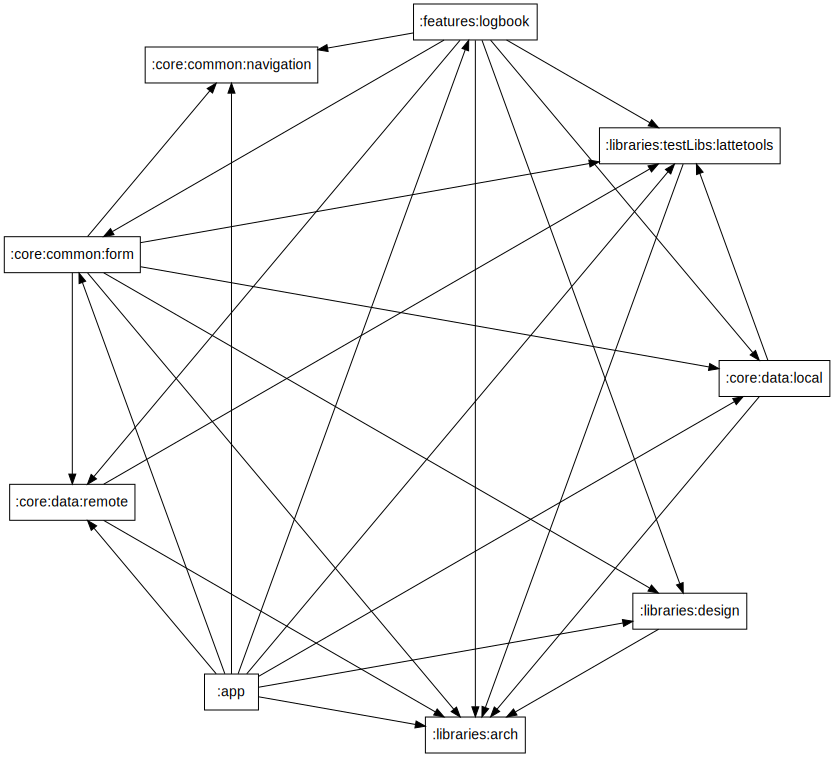

## This project involves the use of:

* [Koin dependency injection](https://insert-koin.io/)

* [Kotlin Coroutines](https://developer.android.com/kotlin/coroutines)

* [MVVM - presentation pattern](https://en.wikipedia.org/wiki/Model%E2%80%93view%E2%80%93viewmodel)

* [Clean architecture](https://blog.cleancoder.com/uncle-bob/2012/08/13/the-clean-architecture.html)

* [Builder pattern](https://refactoring.guru/design-patterns/builder)

* [StateFlow for View states](https://developer.android.com/kotlin/flow/stateflow-and-sharedflow#stateflow)

* [SharedFlow for View actions](https://developer.android.com/kotlin/flow/stateflow-and-sharedflow#sharedflow)

* [ListAdapter - Generic adapter](https://developer.android.com/reference/androidx/recyclerview/widget/ListAdapter)

* [DiffUtil](https://developer.android.com/reference/androidx/recyclerview/widget/DiffUtil)

* [ViewBinding](https://developer.android.com/topic/libraries/view-binding)

* [Lifecycle](https://developer.android.com/guide/components/activities/activity-lifecycle)

* [Room](https://developer.android.com/training/data-storage/room)

* [Retrofit](https://square.github.io/retrofit/)

## Unit tests, integration tests and instrumentation tests with

* [Espresso](https://developer.android.com/training/testing/espresso)

* [Mockk](https://mockk.io/ANDROID.html)

* [Robot Pattern](https://jakewharton.com/testing-robots/)

## Quality

* [CI/CD - Bitrise](https://en.wikipedia.org/wiki/CI/CD)

* [Detekt](https://detekt.dev/)

* [JaCoCo](https://en.wikipedia.org/wiki/Java_code_coverage_tools)

## Module dependencies

* [Modularization](https://developer.android.com/topic/modularization)

<kbd>

</kbd>
